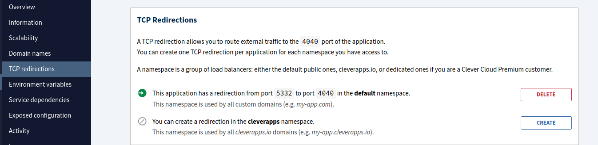
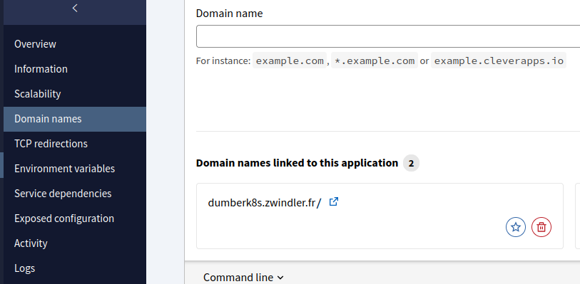

# k8s on Clever Cloud's linux type app

**The most dumb k8s control plane implementation you're gonna find.**

Clever cloud is releasing in some months a Managed Kubernetes offer.

But can we create our own with what we have today in clever cloud's offer???

I'm using the "linux" app type (https://www.clever-cloud.com/developers/doc/applications/linux/) from clever cloud to start a whole Kubernetes control plane.

I'm doing it just for fun and educational purposes. Don't use it. Even for personal use...

## How does it work?

This project works the same way my tutorial [demystifions-kubernetes](https://github.com/zwindler/demystifions-kubernetes) works.

This projects:
- downloads all kubernetes control plane components
- creates a bunch of certs for components authentication
- launches them all as processes with only the necessary options

In clever cloud, this is done in multiple phases.

- **Build phase** (`.mise-tasks/build`): Downloads binaries, generates certificates, sets up static configuration
  - **Cached** across app restarts
  - Only runs when code changes

- **Run phase** (`.mise-tasks/run`): Generates dynamic tokens and starts workers

## Installation

### 1. Setup Repository

Just clone or copy this repository. 

### 2. Create a linux app using CLI or console

Create the app in clever cloud console (or using CLI) and point it to your repo.

1. log into your terminal

```bash
$ clever login

Opening https://console.clever-cloud.com/cli-oauth?cli_version=3.13.1&cli_token=xxxxxxxxxx in your browser to log you in…
We're still waiting for the login process (in your browser) to be completed…
Login successful as Denis Germain <blog@zwindler.fr>
```

2. Link the repo to the app.

If that's not already done, link your repo to the app in clever cloud

```bash
$ clever link <app_id>
✓ Application app_xxxxxxxx-xxxx-xxxx-xxxx-xxxxxxxxxxxx has been successfully linked!
```

Once this is done, a .clever.json file is created

```json
{
  "apps": [
    {
      "app_id": "app_xxxxxxxx-xxxx-xxxx-xxxx-xxxxxxxxxxxx",
      "org_id": "user_xxxxxxxx-xxxx-xxxx-xxxx-xxxxxxxxxxxx",
      "deploy_url": "https://github.com/github-username/your-app-name.git",
      "git_ssh_url": "https://github.com/github-username/your-app-name.git",
      "name": "your-app-name",
      "alias": "your-app-name"
    }
  ]
}
```

### 3. Setup TCP Redirection

I met a slight restriction. In order to expose the self generated TLS encrypted api-server, you have to enable TCP redirection, which listens on port 4040 and exposes port 5XXX (this port seems to be random) on your clever cloud app URL.

```bash
clever tcp-redirs add --namespace default
Successfully added tcp redirection on port: 5131
```

or from the console:



### 4. Configure Domain

Once we know WHICH port that is exposed externally, we can setup our domain.

In my script I use `k8soncleverlinux.zwindler.fr` and port 5131 (in my example), but you'll obviously need to modify it to your own values.

You can configure it via environment variables:

```bash
# Set your custom domain and TCP port
clever env set K8S_DOMAIN your-domain.com
clever env set K8S_TCP_PORT 5131
```

If you want to use it remotely, add the domain in the app settings (this requires having access to a domain and DNS CNAME records).



Note: you can probably just use app-xxxxxxxx-xxxx-xxxx-xxxx-xxxxxxxxxxxx.cleverapps.io default clever cloud URL but I haven't tried.

### 5. Configure Workers

All control plane processes are run in the background using a clever cloud feature called "workers". So we need to configure the app we just created to do just this.

On you local machine:

```bash
# Configure workers for automatic process management
./setup-clever-workers.sh
```

This script will:
- 🌐 Configure domain settings (with defaults you can override)
- 🔧 Set up 5 workers managed by systemd:
  - **Worker 0**: etcd database
  - **Worker 1**: kube-apiserver  
  - **Worker 2**: kube-controller-manager
  - **Worker 3**: kube-scheduler
  - **Worker 4**: HTTP server

### 6. You can now start the app.

[Mise](https://mise.jdx.dev/registry.html) should install some dependencies (cfssl, etcd, kubectl, python) and the setup will complete. After less than a minute you should get :

```
...
2025-07-19T13:16:48.479Z ✅ Kubernetes cluster setup complete!
2025-07-19T13:16:48.479Z 🔧 Running with Clever Cloud workers:
2025-07-19T13:16:48.479Z   • Worker 0: etcd database
2025-07-19T13:16:48.479Z   • Worker 1: kube-apiserver
2025-07-19T13:16:48.479Z   • Worker 2: kube-controller-manager
2025-07-19T13:16:48.479Z   • Worker 3: kube-scheduler
2025-07-19T13:16:48.479Z   • Worker 4: HTTP server
...
```

Control plane is up and running.

## Try the control plane

As it is, the control plane in itself works, but we can't interact with it. 

BUT we can SSH connect to the clever cloud "linux" instance and try to run some `kubectl` commands to see if it really works

```bash
$ clever ssh
Opening an ssh shell.
Warning: Permanently added '[203.0.113.30]:28925' (ED25519) to the list of known hosts.
Last login: Fri Jul 18 20:17:00 UTC 2025 on pts/0

bas@yyyyyyyy-yyyy-yyyy-yyyy-yyyyyyyyyyyy ~ $ pwd
/home/bas
```

Navigate to the app_something dir, and you'll find your repository files

```bash
bas@yyyyyyyy-yyyy-yyyy-yyyy-yyyyyyyyyyyy ~ $ cd app_xxxxxxxx-xxxx-xxxx-xxxx-xxxxxxxxxxxx/
bas@yyyyyyyy-yyyy-yyyy-yyyy-yyyyyyyyyyyy ~/app_xxxxxxxx-xxxx-xxxx-xxxx-xxxxxxxxxxxx $ ls
admin.conf                   generate-certs.sh          setup-kubeconfig.sh
bin                          generate-external-node.sh  setup-node-rbac.sh
bootstrap-token.txt          generate-worker-script.sh  setup-worker-node.sh
bootstrap-token.yaml         mise.toml                  start-control-plane.sh
certs                        node-bootstrap-rbac.yaml   start-etcd.sh
etcd-data                    README.md                  start-services.sh
generate-bootstrap-token.sh  setup-binaries.sh
```

Set KUBECONFIG and try a `kubectl` command

```
export KUBECONFIG=admin.conf

kubectl version
Client Version: v1.33.2
Kustomize Version: v5.6.0
Server Version: v1.33.2
```

Hurray!! We are running a Kubernetes control plane on Clever Cloud.

You can also copy the admin.conf file locally, and change the `server: https://127.0.0.1:4040` to `server: https://k8soncleverlinux.zwindler.fr:5131` and it should work as well.

```bash
$ kubectl cluster-info
Kubernetes control plane is running at https://k8soncleverlinux.zwindler.fr:5131

To further debug and diagnose cluster problems, use 'kubectl cluster-info dump'.
```

But can we use it to **run anything**?

## Add a worker

I can't use the **linux** clever cloud app to create a worker (that would mean installing containerd or another container runtime and I don't think I have enough privileges). But any IaaS VM will do and that's what the helper script is for.

If you've looked at the app logs, you may have seen 2 things of interest:

```
#at step 7
2025-07-18T19:54:39.208Z ✓ Bootstrap token created: xxxxxx.xxxxxxxxxxxxxxxxxxxxxxxx
2025-07-18T19:54:39.208Z Token saved to: bootstrap-token.txt
2025-07-18T19:54:39.208Z 🔑 Bootstrap token: xxxxxx.xxxxxxxxxxxxxxxxxxxxxxxx
2025-07-18T19:54:39.208Z Save this token - you'll need it for worker node setup!
...
#at step 9
2025-07-19T13:16:48.429Z 📝 Step 9: Generating worker setup script...
2025-07-19T13:16:48.432Z === Generating worker node setup script ===
2025-07-19T13:16:48.432Z Versions:
2025-07-19T13:16:48.432Z   Kubernetes: 1.33.3
2025-07-19T13:16:48.432Z   Containerd: 2.1.3
2025-07-19T13:16:48.433Z   Runc: 1.2.6
2025-07-19T13:16:48.433Z   CNI: 1.7.1
2025-07-19T13:16:48.436Z Creating worker node setup script...
2025-07-19T13:16:48.448Z Embedding CA certificate in worker script...
2025-07-19T13:16:48.462Z Embedding kube-proxy kubeconfig in worker script...
2025-07-19T13:16:48.472Z ✓ Worker setup script generated: setup-worker-node.sh
```

Now, since we have the bootstrap token and the CA and an external endpoint for the API server, we could enroll a node by hand. 

BUT, if step 9 worked correctly, everything you need to start a new worker node and enroll it to our control plane is already generated:

```bash
#!/bin/bash

# External Worker Node Setup Script for Kubernetes
# Run this script on your external worker node

set -e

# Configuration - Auto-detected with override options
# Override these variables before running if the auto-detection is incorrect
NODE_NAME_OVERRIDE=""  # Leave empty to use hostname, or set to override
NODE_IP_OVERRIDE=""    # Leave empty to auto-detect, or set to override (e.g., "192.168.1.100")
API_SERVER_ENDPOINT="https://xxxxxxxxxx.domain.org:5131"
BOOTSTRAP_TOKEN="xxxxxx.xxxxxxxxxxxxxxxx"
...
```

Just copy paste it to a linux VM capable of running kubelet and containerd, run it and you should be good to go. Should you need to override the node name or IP, you can, but the script should autodetect this.

```
...
✓ Worker node setup completed!

Check status with:
  sudo systemctl status kubelet
  sudo systemctl status kube-proxy

Check logs with:
  sudo journalctl -u kubelet -f
  sudo journalctl -u kube-proxy -f

```

Note : if you are interested in bootstrap tokens, take a look here

* https://kubernetes.io/docs/reference/access-authn-authz/bootstrap-tokens/

Once this is done, the kubelet should register the Node with the bootstrap token, and it should appear as NotReady because we haven't set up a CNI plugin for now.

```
kubectl get nodes
NAME       STATUS     ROLES    AGE   VERSION
dumber01   NotReady   <none>   13m   v1.33.3
```

I've tried to setup Calico but it failed. Flannel worked out of the box though. I haven't tried with Cilium.

```bash
kubectl apply -f https://github.com/flannel-io/flannel/releases/latest/download/kube-flannel.yml
```

And tadaaaaaa

```bash
$ kubectl get nodes
NAME       STATUS   ROLES    AGE   VERSION
dumber01   Ready    <none>   30m   v1.33.3
$ kubectl get pods -A
NAMESPACE      NAME                    READY   STATUS    RESTARTS       AGE
kube-flannel   kube-flannel-ds-b65jg   1/1     Running   0              14m
```

## Known issues

Since the external Node is NOT in clever cloud network, I'm having issues to make api-server communicate with the kubelet (not the other way around). api-server doesn't know "how" to contact the node to extract logs or port-forward or exec... This probably requires exposing publicly the kubelet (don't do this) or setting up a VPN (or use konnectivity?).

Also, by recreating a new app, I discovered that the TCP redirection port is random... I'll need to make this configurable.

## Workarounds

Even though we are using the TCP redirection, Clever Cloud expects you to run a HTTP application on 8080 port. So I added a dummy python3 webserver that listens on port 8080 to avoid this message:

```console
2025-07-18T19:50:58.165Z Nothing listening on 0.0.0.0:8080 yet. If the deployment fails after this message, please update your configuration and redeploy.
```

## Future work

If I continue to find this project funny, I might add missing binaries to mise by creating aqua or ubi packages for `cfssljson` and `kube-.*`, eliminating the need to curl the binaries myself in `setup-binaries.sh`.

I'll improve documentation to include CLI **and** console options every time.

Should clever cloud ever release the [MateriaDB](https://www.clever-cloud.com/blog/company/2024/04/16/materiadb-kv-materia-functions/) **etcd** shim, I may also add an option to use it as an external database. This will allow us to create more replicas of the control plane, thus paving the way to a highly available "dumber k8s". That would be awesome.

Optionally, I could try to use [kine](https://github.com/k3s-io/kine) to use existing external DBaaS from clever cloud to achieve the same goal.

